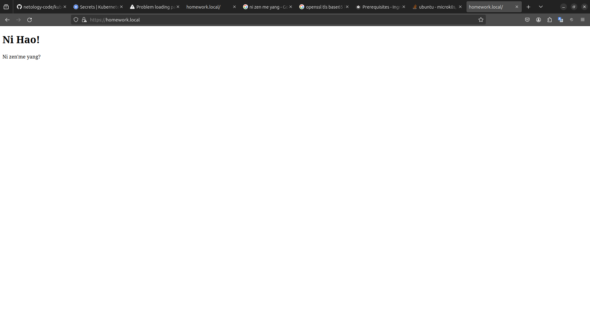

# Домашнее задание к занятию «Конфигурация приложений»

<br>

## Задание 1.

Запуск приложения с подключением configMap:

```
kubectl get pods 
NAME                                  READY   STATUS    RESTARTS       AGE
nginx-multitool-7cd7457944-c9pqr      2/2     Running   0              45s
```

Демонстрация работы приложения с настройкой nginx при помощи configMap:

```
kubectl get service
NAME         TYPE        CLUSTER-IP       EXTERNAL-IP   PORT(S)    AGE
nginx-srv    ClusterIP   10.152.183.211   <none>        8080/TCP   16m

kubectl exec -ti pods/nginx-multitool-7cd7457944-c9pqr -c multitool -- bash

nginx-multitool-7cd7457944-c9pqr:/# curl 10.152.183.211:8080
<!DOCTYPE html>
<html>
<body>

<h1>Ni Hao!</h1>

<p>Ni zen'me yang?</p>

</body>
</html>
```
<br>

## Задание 2. 

Демонстрация работы приложения с помощью ingress с tls secret:

